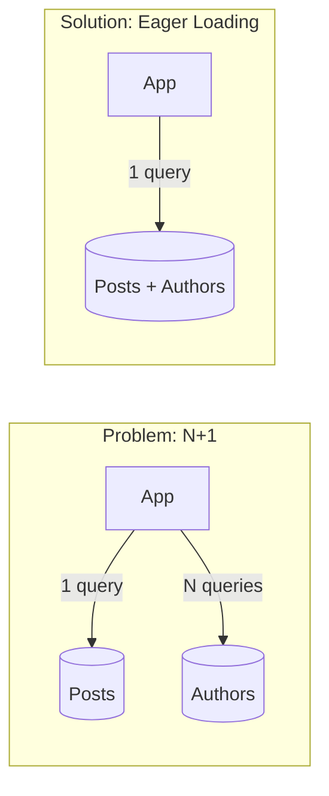

# N+1 Problem: A Comparative Study across Multi-Language Ecosystems

github link : https://github.com/maulanaaghnii/n-plus-one-problem

[](https://opensource.org/licenses/MIT)

This repository serves as a comprehensive study of the **N+1 Problem** in modern software development. Here, I demonstrate how this issue arises, its impact on application performance, and the appropriate solutions across popular ecosystems: **.NET (C#)**, **Go (Golang)**, **Python**, and **Node.js**.

## 🚀 What is the N+1 Problem?

The N+1 problem occurs when an application executes `N` database queries (for each item in a collection) plus 1 initial query (to fetch the collection itself), when all data could have been retrieved in 1 or 2 efficient queries.

### 📉 The Problem vs. The Solution

| Feature | **Bad Practice (N+1)** | **Best Practice (Eager Loading)** |
| :--- | :--- | :--- |
| **Logic** | Fetch 1 by 1 in a loop | Fetch everything in 1 go |
| **Queries** | 🔴 1 + N queries | 🟢 1 query |
| **Complexity** | ❌ $O(N)$ | ✅ $O(1)$ |
| **Efficiency** | Decreases as data grows | Remains consistently fast |

---

### 📊 Query Flow (Single Request)



---

## 🛠️ Multi-Language Implementation

Each folder contains a standalone project demonstrating **Bad Practice** vs **Best Practice**.

| Language | Framework/ORM | Solution Pattern |
| :--- | :--- | :--- |
| **.NET (C#)** | Entity Framework Core | `Include()`, `AsNoTracking()` |
| **Go (Golang)** | GORM & SQLx | `Preload()`, Joins |
| **Python** | SQLAlchemy | `joinedload()`, `subqueryload()` |
| **Node.js** | Prisma / TypeORM | `include`, `select` |

---

## 📊 Performance Comparison (Example)

| Method | Number of Queries (100 items) | Response Time (Local) |
| :--- | :--- | :--- |
| **Naive Approach (N+1)** | 101 | ~450ms |
| **Eager Loading / Joins** | 1 | ~35ms |

*Data above is simulated using PostgreSQL/SQLite databases.*

---

## 📂 Folder Structure

```text
.
├── dotnet/      # .NET 8 Web API + EF Core
├── golang/      # Go Fiber/Gin + GORM
├── python/      # FastAPI + SQLAlchemy
├── nodejs/      # Express + Prisma
└── docs/        # Analysis and deeper look into DB Profiling
```

---

## 🧠 Why This Repository Matters?

As an evolving engineer, I understand that writing code that just "works" isn't enough. Understanding how high-level abstractions (like ORMs) interact with the Database is key to building **scalable** and **performant** systems.

---

## 👨‍💻 Author
**Maulana Aghni** - *Software Engineer*
